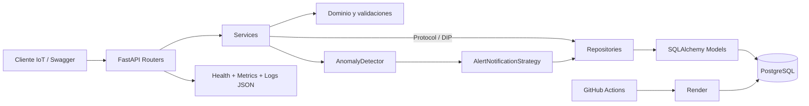

# SensorHub API

[](https://github.com/JulianCordobaMtz/sdlc-electronica-julian/actions/workflows/ci.yml)

API REST de telemetría IoT para registrar sensores y lecturas, validar valores
físicos, detectar anomalías, gestionar alertas y consultar estadísticas. El
sistema usa FastAPI, SQLAlchemy, PostgreSQL, Alembic, Docker y GitHub Actions.

## Estado del proyecto

- Alcance: SensorHub competente+ (RF-1 a RF-7).
- Pruebas locales: 56 aprobadas.
- Cobertura actual: 93.99% (mínimo requerido: 80%).
- Persistencia: PostgreSQL en Docker/producción y SQLite aislado en pruebas.
- Observabilidad: healthcheck con base de datos, métricas HTTP y logs JSON.

### Producción

- [Swagger UI](https://sensorhub-api-julian.onrender.com/docs)
- [Healthcheck](https://sensorhub-api-julian.onrender.com/health)
- [Métricas](https://sensorhub-api-julian.onrender.com/metrics)
- [GitHub Actions](https://github.com/JulianCordobaMtz/sdlc-electronica-julian/actions)

> La rama `semana6` contiene el incremento final. Antes de la entrega se debe
> integrar en `main` y comprobar nuevamente RF-1 a RF-7 en estas URLs. En la
> última revisión previa al merge, `/docs` y `/health` respondían, pero
> `/metrics` aún no estaba desplegado.

## Requisitos funcionales

| ID | Capacidad | Evidencia principal |
|---|---|---|
| RF-1 | CRUD de sensores con desactivación en lugar de borrado físico | `/sensors` |
| RF-2 | Ingesta con validación física por tipo y unidad | `POST /sensors/{sensor_id}/readings` |
| RF-3 | Consulta paginada y filtrada por rango de fechas | `GET /sensors/{sensor_id}/readings` |
| RF-4 | Detección de anomalías y alerta WARNING/CRITICAL | `AnomalyDetector` |
| RF-5 | Consulta y transición open -> acknowledged -> resolved | `/alerts` |
| RF-6 | Mínimo, máximo, promedio y cantidad por periodo | `/sensors/{sensor_id}/statistics` |
| RF-7 | Estado de la base de datos y métricas HTTP | `/health`, `/metrics` |

## Arquitectura



Responsabilidades:

- **Routers:** contratos HTTP, códigos de estado e inyección de dependencias.
- **Services:** casos de uso, reglas de negocio y coordinación.
- **Domain:** validaciones físicas y estados sin dependencia de FastAPI o BD.
- **Repositories:** consultas y persistencia con SQLAlchemy.
- **Models/Schemas:** estructura persistente y contratos de entrada/salida.

Los servicios dependen de protocolos, no de repositorios concretos. Esto permite
usar repositorios falsos en pruebas unitarias y sustituir la persistencia sin
reescribir la lógica de negocio.

## Endpoints principales

| Método | Ruta | Descripción |
|---|---|---|
| POST | `/sensors` | Crear sensor |
| GET | `/sensors` | Listar sensores con `limit` y `offset` |
| GET | `/sensors/{sensor_id}` | Consultar sensor |
| PATCH | `/sensors/{sensor_id}` | Actualizar sensor |
| DELETE | `/sensors/{sensor_id}` | Desactivar sensor |
| POST | `/sensors/{sensor_id}/readings` | Registrar y evaluar lectura |
| GET | `/sensors/{sensor_id}/readings` | Consultar lecturas con paginación y fechas |
| GET | `/sensors/{sensor_id}/statistics` | Consultar estadísticas |
| GET/PATCH/DELETE | `/readings/{reading_id}` | Operar una lectura |
| GET | `/alerts?status=open` | Consultar alertas |
| PATCH | `/alerts/{alert_id}` | Cambiar estado de alerta |
| GET | `/health` | Comprobar API y base de datos |
| GET | `/metrics` | Exponer métricas Prometheus |

Los filtros de fecha usan `from` y `to` en formato ISO 8601:

```text
GET /sensors/TEMP-01/readings?from=2026-08-19T00:00:00&to=2026-08-20T23:59:59&limit=50&offset=0
```

## Ejecución con Docker Compose

Requisitos: Git y Docker Desktop.

1. Clona el repositorio y entra al directorio.
2. Copia la configuración de ejemplo.
3. Construye y espera a que API y PostgreSQL estén saludables.

```powershell
Copy-Item .env.example .env
docker compose up --build --wait
```

Abre `http://localhost:8000/docs`. Al iniciar, el contenedor ejecuta
`alembic upgrade head` antes de levantar Uvicorn.

Para detener los contenedores conservando los datos:

```powershell
docker compose down
```

Para borrar también el volumen local de PostgreSQL:

```powershell
docker compose down --volumes
```

## Ejecución local

```powershell
python -m venv .venv
.\.venv\Scripts\Activate.ps1
python -m pip install -r requirements.txt
python -m alembic upgrade head
python -m uvicorn app.main:app --reload
```

Sin `DATABASE_URL`, el desarrollo local usa `sqlite:///sensorhub.db`. En
Docker y Render debe definirse una URL PostgreSQL.

## Configuración

| Variable | Uso |
|---|---|
| `DATABASE_URL` | Conexión SQLAlchemy/Alembic |
| `POSTGRES_USER` | Usuario del PostgreSQL local |
| `POSTGRES_PASSWORD` | Contraseña del PostgreSQL local |
| `POSTGRES_DB` | Base local |
| `LOG_LEVEL` | Nivel de logs; por defecto `INFO` |

No se versiona `.env`. El archivo `.env.example` contiene únicamente valores
de desarrollo.

## Calidad y pruebas

```powershell
python -m pytest --cov=app --cov-report=term-missing --cov-fail-under=80
python -m ruff check .
python -m mypy app --ignore-missing-imports
```

La suite combina pruebas unitarias con repositorios falsos y pruebas de
integración HTTP usando una base SQLite en memoria aislada.

## CI/CD

El workflow ejecuta:

1. Ruff, Mypy y Pytest con cobertura mínima de 80%.
2. Construcción de la imagen Docker sin publicarla.
3. Despliegue del commit validado a Render únicamente en un push a `main`.

El repositorio necesita el secreto `RENDER_API_KEY` y la variable
`RENDER_SERVICE_ID`. Render usa `/health` para aceptar o rechazar el
despliegue.

## Observabilidad y errores

- Cada solicitud recibe o conserva un `X-Request-ID`.
- Los logs salen como una línea JSON con ruta, método, estado y duración.
- Los errores 404, 409, 422 y 500 mantienen una estructura uniforme.
- Los fallos inesperados no exponen contraseñas ni trazas al cliente.
- `/metrics` publica conteos y tiempos acumulados en formato Prometheus.

## Decisiones de arquitectura

- [ADR-0001: Arquitectura en capas y DIP](docs/adr/0001-arquitectura-en-capas.md)
- [ADR-0002: PostgreSQL, Alembic y despliegue reproducible](docs/adr/0002-postgresql-alembic-y-despliegue.md)

## Evidencia de entrega

- [Bitácora consolidada de IA](AI_LOG.md)
- [Guía de video y presentación](docs/DEMO_Y_PRESENTACION.md)
- [Historial del pipeline](https://github.com/JulianCordobaMtz/sdlc-electronica-julian/actions)

## Pendientes antes de entregar

- Integrar `semana6` en `main` mediante Pull Request.
- Confirmar el trabajo de despliegue en verde.
- Probar RF-1 a RF-7 directamente en producción.
- Grabar el video de respaldo y ensayar la presentación.
